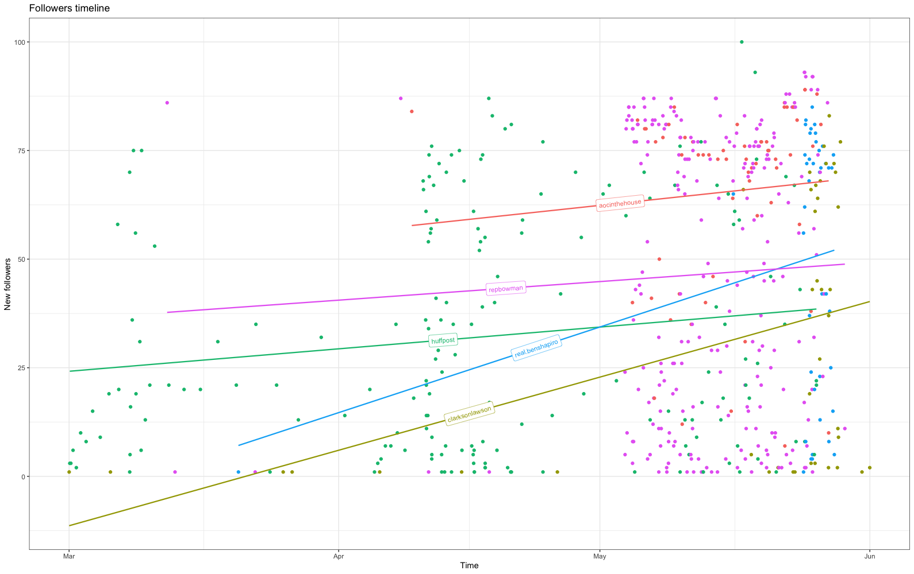

# TikTok’s Users Analysis in the Context of US Politics

> Repository for Advanced Topics in Computer and Networks Security course at University of Padua (master degree in computer science)

In this repository there's just the code divided in two group: data gathering and data analysis.

_The data downloaded is not been uploaded to protect users' privacy._

**Authors:** @albertomorini and @mhetacc

Read the report in way to better understand the study done: Report_BelloMorini.pdf

## Some analysis

