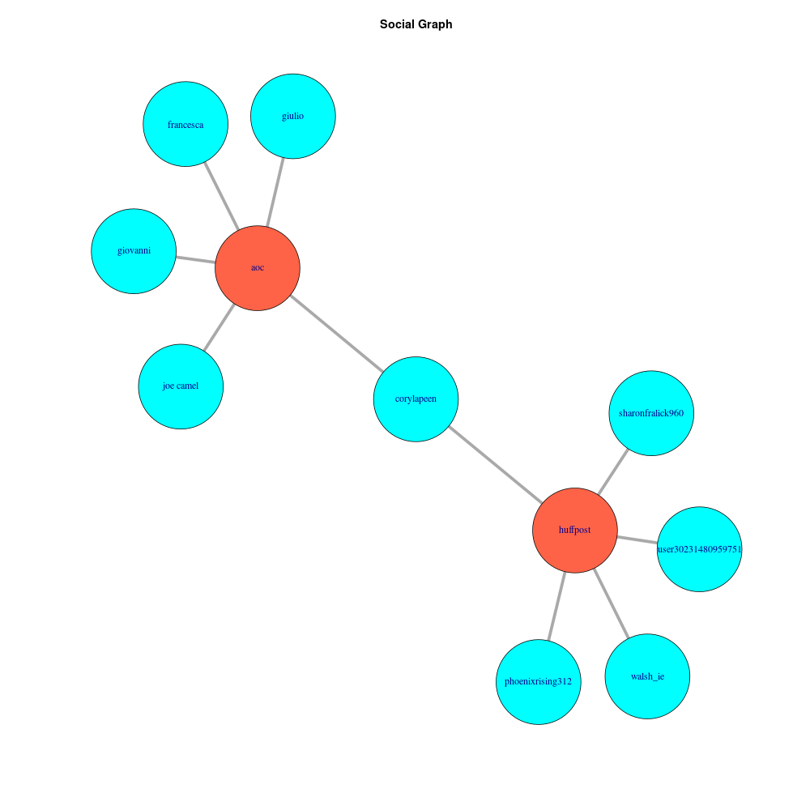

# TikTok Social Analysis 

University of Padua's Advance Topics for Cybersecurity course's project.
Made by 
- Alberto Morini ([albertomorini](https://github.com/albertomorini)) 
- Marco Bellò ([mhetacc](https://github.com/mhetacc))

## Project Goals

The idea is utilize TikTok's official [APIs](https://developers.tiktok.com/doc) in order to study users behaviors and political positioning in the context of the next 2024 US presidential elections.

### Goal 1 : Social Graph

The idea behind a Social Network Graph is to clearly show relations (represented as edges) between users (represented as nodes). \
This is done in order to see how high is the degree of intersection between different political fields (or how low it is, leading to echo chambers), starting from "root" nodes represented by a list of selected influencer and moving on through their respective followers. 

Let's see an example: 


We can clearly see the idea in action: user *@corylapen* represent an intersection between the user-bases of *@aoc* and *@huffpost*. In this case we do not have a bridge between two political areas (both these influencer are left-leaning) but its clear how this could be utilized.

### Goal 2 : Followers Region

It could be of interest to learn the followers nationality of our pool of influencers: this will allow us to either conjecture about possible outsider's influence, and to whom it is directed (left or right wing). \
This information can also be intertwined with data from both the social graph and the sentiment analysis, to get even more insights about the political landscape.

### Goal 3 : Video Comments Sentiment Analysis 

The idea is to use libraries and services from either R or AWS to do a sentiment analysis on the comments under the videos of our pools of influencers. \
We can then use this information to see if the user-base is aggressive or supportive and, provided more information about it, we can see if this has any correlation with the political orientation or nationality of the users.

### Goal n

TODO?
 
## Methodology  

First, two lists (left-leaning and right-leaning) of influencer have been compiled, in order to have two "pools" of data with a clear political orientation. \
This has been done to avoid creating the pools with automated tools, like ML or NLP, that have been deemed not precise enough. \
**TODO**
The influencer's handles used to gather data are summarized in the following list (EITHER the complete list can be found [here](https://github.com/albertomorini/CNS/blob/main/msc/handles.txt))(OR not all of the following handles have been used to gather the data presented in this report):
- Right: 
    - [@huffpost](https://www.tiktok.com/@huffpost)
    - @aoc 
    - tre
- Left: 
    - uno
    - due 
    - tre

### Social Graph

Starting from the influencers pool, we query their followers using TikTok's official [APIs](https://developers.tiktok.com/doc/research-api-specs-query-user-followers/)

```python
def getFollowers(username,cursor):
    res = requests.post(TikTok_URLs['followers'],
    headers={
        'Authorization':'Bearer '+getAuthToken(),
        'Content-Type': 'application/json'
    },
    data=json.dumps({
        'username': username,
        'max_count': 100, #Default is 20, max is 100.
        'cursor': cursor #NOTE: unix timestamp
    })
    )
    if(res.status_code==200):
        return res.json()
    else:
        writeLog('Error downloading followers, code: '+str(res.status_code),'ERROR')
        return None

```

TODO

## Results

### Social Graph

TODO \
a lot / not a lot of echo chambering 

## Extensions

### Social Graph

TODO \
- increase data layers 
    - influencer -> user follower -> user follower following -> repeat
- give node weight based on followers count
    - from user info

## Problems -> just put in methodolgy paragraph?

### Social Graph

TODO \
User pooling via official APIs:
- not truly randomic
- no transparency
- only 100 user per request -> per time stamp 


-------- 
## API

How the api works - to insert into the paper


~~TikTok's API works as shit~~
TikTok's API need a previous authentication composed with a Secret Key and a Client ID, obtainable through a personal request to the staff of the platform.
Each calls to the API require to be authenticated with a Bearer token previously obtained via the authentication endpoint, then, the various endpoints responds to the query string and body of the HTTP request as standard.

There's a limit quota of 100'000 records per day (reset at 12 AM UTC) for videos and comments, instead for followers/following endpoint the limit is settled up to 2M of records.

In this project, every call is parametrized to retrieve the maximum of allowed data, usually 100 records. However, the APIs doesn't always provide the exactly data requested, this maybe because there's no data to download or other unknown issues.

https://developers.tiktok.com/doc/research-api-faq/

### how much data we retrieved

insert calcoli (li hai sull'iPad)


## post impact

We would analyze what's the impact of a new content posted by an influencer in terms of followers.

So basically, has been downloaded all the video of the influencers in the last five month (as explained in chapters before), then, for each video has been downloaded the users which had followed the influencer between 5 days after.
Certanly, this could be a bias, because a new follower can gained indipendently of the new post, but, nowadays in social network a content became virual almost immediatly or never will.

Unluckly the API of the followers, accept a parameter "cursor" which represent the date of from when we'd like to get the followers, but, the API's response isn't the exactly day, in fact as mentioned in the docs:
"citare la docs"

So we basically download the followers into a smaller scope: followers every 3h for 5 days.
At the end we of course gets some duplicates, that we've removed with a temporal logic: we keep the association of "username:datetime" only of the first occurrence


** inserire il grafico **
> In the graph we can see the followers trend divided per influencer through the time.
> Since the followers are downloaded from the date of a video up to 5 days next, has also been added the timestamp of video published thus to search a correlation between followers and content.

## Engagement

We'd like also to give a dimension of the data analyzed, so basically, for each video we retrived some basic information.

In example, the API's for every video returns data like the numbers of view, comments, likes, shares

** inserire il grafico **
> Study the engagement on TikTok can shows how many people are reached and what's the approval quota of a content.
> So for every influencer has been conducted the same analysis, arranging the total views/comments/likes of videos

And also compared the two "wings" to spot the difference in terms of numbers


TODO: dividere/spiegare le influenze di destra e di sinistra (as marco diceva, è più usato da gente di sx - i dx complottano?)


-----------------------------------

## Influencer downloaded:

**right wing**:
- alynicolee1126
- babylonbee
- real.benshapiro
- clarksonlawson
- notvictornieves

**left wing**:

- thedailybeast
- huffpost
- aocinthehouse
- repbowman
- newyorker
