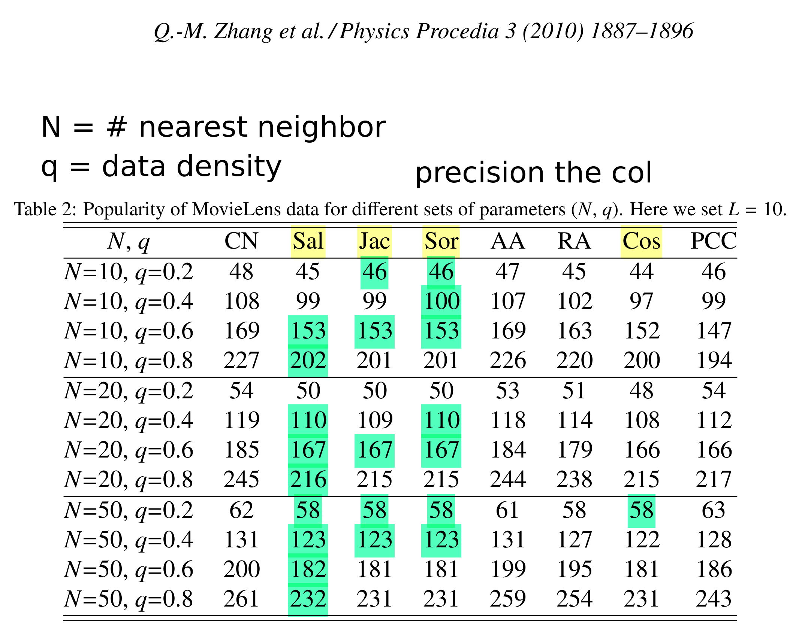
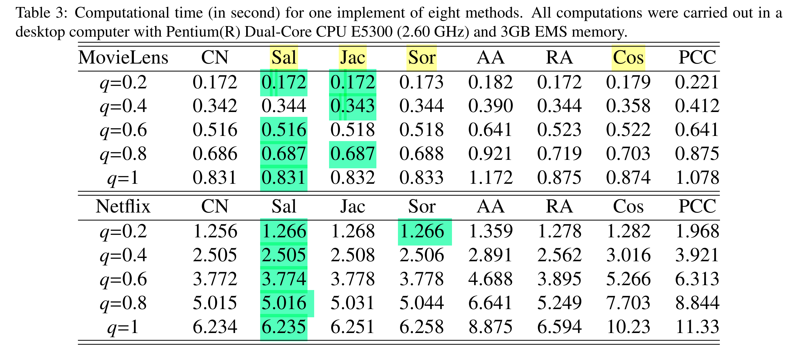

Format: source url \newline stuff from the specific source
	- potential influencer name and/or @handle


Democrat Politician List (search on tiktok) + sources:
https://today.yougov.com/ratings/politics/fame/Democrats/all
https://en.wikipedia.org/wiki/2024_Democratic_Party_presidential_primaries#Candidates
- AOC Alexandra Ocasio Cortez [mandatory]
- Bernie Sanders
- Kamala Harris
- Jimmy Carter
- Nancy Pelosi
- Robert F. Kennedy Jr.
- ofc Joe Biden


Republican Politician List (search on tiktok) + sources:
https://today.yougov.com/ratings/politics/fame/Republicans/all
https://en.wikipedia.org/wiki/2024_Republican_Party_presidential_primaries
- Mike Pence
- Ted Cruz
- Ron DeSantis
- Nikki Haley
- ofc Donald Trump (not on tt?)


https://www.foxnews.com/politics/conservative-tiktok-influencers-platform-discriminates-against-right-leaning-voices \
right wing:
 - Victor Nieves
 - Morgonn McMichael
 - Clarkson Lawson

left wing:
 - Harry J. Nisson
 - Under the Desk News
 - Chris Mowrey

https://www.foxnews.com/media/tiktok-silenced-11-pro-free-speech-organizations-while-muzzling-conservatives-study-finds \
right wing:
 - Lt. Col. Allen West
 - Judicial Watch President Tom Fitton
 - MRCTV
 - PragerU
 - Students For Life of America
 - The Babylon Bee
 - Michael Knowles
 - Timcast IRL
 - Young American Foundation
 - Kyle Rittenhouse

https://thehill.com/opinion/technology/4035504-tiktok-has-a-political-influencer-problem-targeted-at-gen-z-voters/ \
began organizing paid influencers on TikTok and other social media platforms as early as 2020. Democrat-aligned PR firms such as Main Street One (now renamed People First) pioneered such tactics
Republican and Conservative hype houses on TikTok also campaign on behalf of political candidates. 
Influencer-driven marketing firms now claim to control massive, immediately-deployable, stables of small-scale influencers on behalf of a given campaign. These “nano” and “micro” influencers aren’t what most people think of when they imagine an influencer. Most aren’t celebrities, either online or offline. Instead, these are everyday people who have captive, intimate social media audiences who identify with demographics especially appealing to U.S. political campaigns: Latinos in South Florida, Black voters in Atlanta and college-educated women in the Rust Belt. 


https://onlinelibrary.wiley.com/doi/10.1002/poi3.287 \
60% user GenZ, 60% young us adults (18-24) use tiktok daily
almost all kids (5-15) use tiktok daily
On TikTok, however, a large follower base does not guarantee visibility. Creators’ influence is based on the performance of individual posts. Therefore, creating viral content is the primary means for visibility and sociality
[The creators quoted in this study, however, described more instances of controversy due to the politically charged nature of their content]
check (likely all left-wing): - @rynnstar @vocaloutburst @damoyee @violetbutnotaflower(lgbt) @thctai @alexengleberg @jakedoesmusicsometimes @rvmillz @emersonbrophy
use to find bigger videos -> typing any letter after pressing the ‘#’ key displays suggestions for the most popular hashtag (i.e., typing ‘f’ displays suggestions #fyp, #foryou, #foryoupage
use to find bigger videos -> they were posting or hashtags that were nonsensical, such as in the case of #xyzbca, a trending hashtag with over 1.5 trillion views as of October 2021
oss: #blacklivesmatter, While millions of videos included BLM hashtags, still more millions were examples of hashtag hijacking that had nothing to do with the cause.
some interviewees described strategies to reduce their visibility to avoid harassment, reports or shifts in content recommendations. For example, Damoyee (@damoyee) would deliberately interact with videos that aligned with her personal views to see more similar content and cause a knock-on effect of her content being seen by other like-minded users as well.
But [on] TikTok you can make 65 accounts and just comment whatever you want from all of them (Gabbi @fettucinefettuqueen).

https://journals.sagepub.com/doi/full/10.1177/20563051231177938 \
“lack of systematic empirical evidence” (p. 5) regarding political influencers—a gap this special issue seeks to close.
the category of political influencers includes social media users who do not come from an institutional background and whose notoriety and fame is platform-built
Oss: Sonoma Ballots, SharpieGate, and Maidengate
conservative influencers - Ben Shapiro and - Steven Crowder

https://onlinelibrary.wiley.com/doi/10.1002/poi3.150 \
For instance, Conover et al. (2011) analyzed political hashtags some weeks before U.S. congressional midterm elections and observed that retweets reproduce the known partisan split in the online world, while the mention network shows that ideologically opposed individuals interact with each other
The maximum geodesic distance (diameter) of the three networks is three, which means that a maximum of three steps is needed to cross the network. The average distance of the three networks is 1.5, indicating that the average distance between the users is 1.5 steps. Moreover, the average density of the three networks is 0.32. This shows that 32 percent of the total possible relations actually occur. Although the density in all the networks is low, the short distances make it possible to connect easily to others.

https://www.frontiersin.org/articles/10.3389/fcomm.2021.752656/full \
In the United States election 2020, presidential candidate Michael Bloomberg engaged in paid partnerships on social media (Lorenz 2020). In Germany, the political party CSU invited influencers to political events and since recently also creates influencer-like social media posts on platforms such as TikTok

https://journals.sagepub.com/doi/10.1177/19401612221088987 \
perceived simplification of politics (PSP)  certain functions of opinion leaders such as information and complexity reduction, providing orientation, or arousing interest for topics, particularly on social media, which is dominated by limited characters and visual content
frequency of exposure to influencers’ content is consistently related to PSP.
the surge in political interest in response to PSP happens simultaneously with an increase in political cynicism limate change has clearly marked the socialization of Generation Z (Andersen et al. 2021). Thus, a perceived higher comprehensibility of this topic may amplify young people's interest, although to the detriment of a swelling frustration with the political elite,

https://journals.sagepub.com/doi/10.1177/20563051231177916 \
The 301 pieces of content were coded along the 35 variables by one of the researchers, he other researcher coded the 30 pieces of content as well to calculate the reliability between both researchers and check whether they understood the codebook in the same way. he relevant test of intracoder reliability showed a perfect reliability of 1 according to Krippendorff’s alpha for most variables. Only six of the variables scored below but still within the good or acceptable range (α ≥ .800 or, where tentative conclusions are still acceptable, α ≥ .667; Krippendorff, 2004, p. 241). The variable on the policy area in focus scored a Krippendorff’s alpha of .948, direct reference to one or more parties .934, density of entertainment .892, density of self-presentation .757, density of information .754, and the one on density of opinion scored the lowest with .737. Measured with a simple percentage of agreement (Holsti), density of opinion still reached 90% of agreement, and all other variables scored higher.

https://journals.sagepub.com/doi/10.1177/20563051231177920 \
#nightwolves -> might be a good idea to search for (russian propaganda)

https://www.researchgate.net/publication/356173677_When_Social_Media_Influencers_go_Political_An_Exploratory_Analysis_on_the_Emergence_of_Political_Topics_Among_Finnish_Influencers \
we defined formal political topics to occur when a SMI makes mentions to formal political processes, institutions or actors such as politicians, parties or policies
Approximately 77 percent had deliberately avoided formal political topics, whereas 52 percent had deliberately avoided lifestyle-based political topics. they did not want to be targeted by aggressive internet-commentators

https://ijoc.org/index.php/ijoc/article/view/18987
- Conservative Hype House, Turning Point USA, TikTok Leftists, and the Dem Hype House
Established collectives often have organized structures

https://www.nytimes.com/2022/11/02/us/elections/influencers-political-ads-tiktok-instagram.html 
- Grace Hunter (L)
Political firms, mostly those aligned with Democrats and progressive causes, are increasingly turning to them in hopes of finding ways to reach Generation Z and non-English-speaking voters, according to researchers, and they represent a novel — and unregulated — way of promoting political messages
no federal guidance has been published on the specifics of influencer political advertisements. 
- G.L. DiVittorio, a 27-year-old TikToker who runs a political account called “The Pocket Report” 
- Sam Shlafstein (L), 19, who has more than 137,000 followers on TikTok and works with the nonprofit group Gen-Z for Change

https://foundation.mozilla.org/en/campaigns/tiktok-political-ads/ \
Despite the fact that TikTok “bans” political advertising, these creators regularly use their platforms to disseminate political messaging and viewpoints and they don’t always disclose their paid partnerships.
creators with ties to right-wing: -@taylormjewett -@thepoliticaldropout -@theisabelbrown -@alynicolee1126 -@itsthemandrew -@cadencevaughan -@mcken_leighh -@kagchick -@sophiabfisher
creators with ties to left-wing: -@houseof_us -@davedcomedy 

https://www.climateculture.earth/5-minute-reads/the-political-side-of-tiktok \
left-wing: -@genzforchange, @youth4climatejustice, @aggressivelyprogressive 

https://www.politico.com/news/magazine/2023/08/25/tiktok-influencers-campaigns-bowman-00111497 \
left-wing: - Nguyen known as @_nguyenthaoo 
	   - @repbowman
TikTok has tried to sell itself as a place for everything but politics. Since 2019, the company has banned paid political advertising on the site (“the nature of paid political ads is not something we believe fits the TikTok platform experience,”
62 percent of Republicans back a ban on the platform, while only 33 percent of Democrats feel the same

https://www.politico.com/interactives/2023/tiktok-news-hell-media/ \
There is no Trump or Elon-like “main character” of TikTok who can twist the platform to their will with an errant statement or news announcement, just a sprawling ecosystem of creators all vying to worm their way into as many “For You” tabs as possible.


## Similarities of nodes in networks
https://ceur-ws.org/Vol-1353/paper_14.pdf \
[...]similarity measures between nodes in the network. Several similarity measures, described in the literature are surveyed here with the goal of providing a guide to their selection in various applications. 
### Edge similarity
set similarity provides the index of intersection of node parents (which are, of course among the neighbors) of the nodes being compared
### Global structure similarity
aim to evaluate the similarity between two nodes in the context of the whole network \
Salton Index, Jaccard Index, and Sorensen Index always have good performance. Cosine similarity computational complexity is very high to be applied to very large data

https://www.researchgate.net/publication/222697773_Empirical_comparison_of_local_structural_similarity_indices_for_collaborative-filtering-based_recommender_systems 

Cosine index has high computational cost, so local structure stuff has been made: When the data is dense, the structure-based indices can perform competitively good as Cosine index, while with lower computational complexity. Furthermore, when the data is sparse, the structure-based indices give even better results than Cosine index. \
[*Sparsity*](https://en.wikipedia.org/wiki/Sparse_network): *In network science, a sparse network has much fewer links than the possible maximum number of links within that network (the opposite is a dense network)* \
**Oss:** our network is greatly sparse: most nodes are linked only with one influencer. 



Generally speaking, the diversity decreases with the increasing of N or L (we have low N, L is recommendation film list)



Salton Index, Jaccard Index and Sørensen Index, always have good performances unless the available information is too few, which may be caused by either the extremely sparse training set (i.e., small q) or the very few number of nearest neighbors (i.e., small N) \

#### Cosine similarity

Idea: consider each influencer as a vector of words:
```
influencer = ["follower1", "follower2", "follower3", ... ,"followerN"]
```

**Using lexical vectors:** 

https://www.researchgate.net/publication/359662169_Cosine_similarity-based_algorithm_for_social_networking_recommendation 

This is between written documents
```python
# python
# this gets accuracy rate of around 90% 

import numpy as np
from sklearn.feature_extraction.text import TfidfVectorizer

def pairwise_similarity (descriptions) :
	documents = descriptions
	print(descriptions)
	tfidf = TfidfVectorizer().fit_transform(documents)
	# Vectorizer returns normalized td-idf
	pairwise_similarity = tfidf * tfidf.T
	arr = pairwise_similarity.toarray()

```

https://stackoverflow.com/questions/57092479/finding-the-cosine-similarity-of-a-sentence-with-many-others-in-r

*Stringdist* measure qgrams i.e. sequences of q character. \
Might be a problem: *username=giovanni* and *username=giulio* may be considered related based on this definition.

```r
# R
library(stringdist)

s1 <- "The book is on the table"  
s2 <- "The pen is on the table"  
s3 <- "Put the pen on the book"  
s4 <- "Take the book and pen"  

sn <- "Take the book and pen from the table" 

sv <- c(s1=s1, s2=s2, s3=s3, s4=s4, sn=sn)

# Split sentences into words
svs <- strsplit(tolower(sv), "\\s+")

# Calculate term frequency tables (tf)
termf <- table(stack(svs))

# Calculate inverse document frequencies (idf)
idf <- log(1/rowMeans(termf != 0))

# Multiply to get tf-idf
tfidf <- termf*idf

# Calculate dot products between the last tf-idf and all the previous
dp <- t(tfidf[,5]) %*% tfidf[,-5]

# Divide by the product of the euclidean norms do get the cosine similarity
cosim <- dp/(sqrt(colSums(tfidf[,-5]^2))*sqrt(sum(tfidf[,5]^2)))
cosim
#           [,1]      [,2]       [,3]      [,4]
# [1,] 0.1215616 0.1215616 0.02694245 0.6198245
```


**Using numerical vectors:**

https://www.r-bloggers.com/2021/08/how-to-calculate-cosine-similarity-in-r/

```r
# R
library(lsa)

# between vectors
x <- c(33, 33, 43, 55, 48, 37, 43, 24)
y <- c(37, 38, 42, 46, 46, 59, 41, 50)
cosine(x, y)
# output
[1,] 0.9624844

# using matrices (for similarity between multiple vectors)
x <- c(23, 24, 34, 35, 22, 25, 33, 24)
y <- c(10, 10, 22, 26, 16, 22, 11, 20)
z <- c(14, 15, 35, 16, 11, 23, 10, 41)
matrix <- cbind(x, y, z)
cosine(matrix)
# output
      x         y         z
x 1.0000000 0.9561517 0.8761308
y 0.9561517 1.0000000 0.9163248
z 0.8761308 0.9163248 1.0000000
```

#### Salton index

[Definition](https://math.stackexchange.com/questions/730511/preferential-attachment-and-salton-similarity-in-directed-networks): number of common neighbors between two nodes divided by the square root of the multiplication of the degrees of the nodes

https://cran.r-project.org/web/packages/linkprediction/vignettes/proxfun.html#salton-index-cosine-similarity

1.2 Salton Index (cosine similarity) measures the cosine of the angle between columns of the adjacency matrix, corresponding to given vertices. This measure is commonly used in information retrieval.

$$s_{xy}=\frac{|\Gamma(x)\cap\Gamma(y)|}{\sqrt{k_x\times k_y}}.$$

```r
# R
# Function to calculate s_xy  
# where x, y influencers
calculate_s_xy <- function(x_neighbors, y_neighbors) {
  # x_neighbors: vector of neighbors of node x
  # y_neighbors: vector of neighbors of node y
  
  # Calculate the size of the intersection of neighbors
  intersection_size <- length(intersect(x_neighbors, y_neighbors))
  
  # Calculate the degree of nodes x and y
  k_x <- length(x_neighbors)
  k_y <- length(y_neighbors)
  
  # Calculate s_xy
  s_xy <- intersection_size / sqrt(k_x * k_y)
  
  return(s_xy)
}

# Example usage:
x_neighbors <- c(1, 2, 3, 4)  # Replace with actual neighbors of x
y_neighbors <- c(3, 4, 5, 6)  # Replace with actual neighbors of y

s_xy <- calculate_s_xy(x_neighbors, y_neighbors)
print(s_xy)

```

## Sentiment Analysis 

### Polarization

https://medium.com/@schaider/graph-level-neural-networks-for-predicting-social-network-polarization-4916d9589ecc

Polarization is measured using the network disagreement index (NDI). Given a graph G = (V, E, w) and a *vector of opinions* x ∈ [0,1]ⁿ of individuals in V, the network disagreement index P(G, z) is defined as follows:


[...]nodes were assigned initial opinions and bias levels. Let A be the adjacency matrix for our generated graph. For a given node i, its initial opinions xᵢ(0) are given by:


https://www.researchgate.net/publication/289172658_A_measure_of_polarization_on_social_media_NetworksBased_on_community_boundaries

Measure polarization with communities, more similar to echo chambers than actual opion checking 

### Echo Chambers

https://www.sciencedirect.com/science/article/pii/S2468696424000016

Sentiment analysis used

https://arxiv.org/abs/2307.04668

Distance based

---
We use a graphical view (SAN graph) + salton index to measure distance.

## Writing Numbers
https://www.scribbr.com/academic-writing/numbers/

 APA Style, one of the most common style guides used in academic writing.

In general,**words should be used for numbers from zero through nine, and numerals should be used from 10 onwards**. This is true for both cardinal numbers (e.g., two, 11) and ordinal numbers (e.g., second, 11th). However, there are some important exceptions to this rule.

Use numerals for numbers from zero to nine that are followed by a precise unit of measurement.
Examples:

> The samples measured 7 cm in diameter. (“cm” is a unit of measurement)

> But: These three samples were subjected to further testing.

Use words for any number that is used to start a sentence, with the exception of years.
Examples:

> Seventy-two thousand ink cartridges are sold every day.

> Nineteenth-century novels often feature complicated plot lines.

> But: 2008 saw record olive crops throughout the Mediterranean.

Use words for common fractions and set expressions.
Examples:

> According to the survey, two thirds of the employees are dissatisfied.

> Understanding the Five Pillars of Islam is a critical first step.

> The Fourth of July is traditionally marked by a firework display.


**Writing long numbers**

Longer numbers follow specific rules:

    Use a period to indicate a decimal point.
    Starting with 1,000, use commas to separate every three digits.
    Starting with a million, use a combination of numerals and words.
    Examples:

  > The region has an average of 43.75 doctors for every 10,000 people.

  > Some predict that the number of users will reach 2 billion by 2020.


